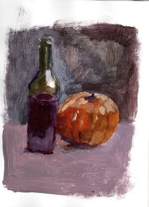
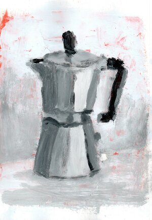
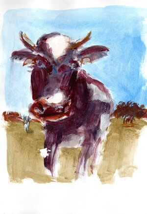
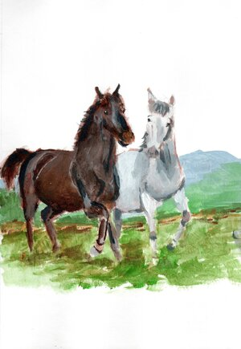
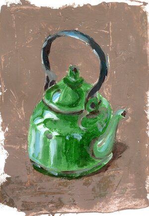
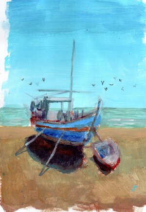
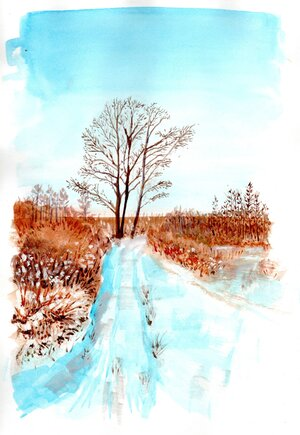

This year I decided to do Advent of paint. 

The goal of it is to paint every day during Advent of Christmas. I've managed paint 15 pictures. In the end I was a little bit overwhelmed by the idea. I think doing something every day is not good for me. Next time I might do painting every 2 days? 

I started to paint with acrylics with the idea of painting loose and with bold brushmarks. I come to conclusion that I like acrylics, they are very versitile. What I don't like is cleaning up after painting session. So I switched back to gouache. Still I like both of the mediums and will definatelly do some more acrylics in future.   

Here's the whole gallery. The best paintings (in my opinion :) will be added to main gallery as well.

<ul id="media" class="clearfix justified-gallery">

</ul>
