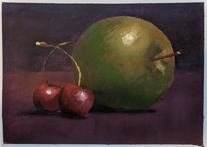

I took part in [Paint Coach](https://www.youtube.com/@paintcoach) paint week.

It consisted of 2 painting demos to reproduce. 
I used my water soluble oil paints for this. Here are effects of my work.

<ul id="media" class="clearfix justified-gallery">

</ul>