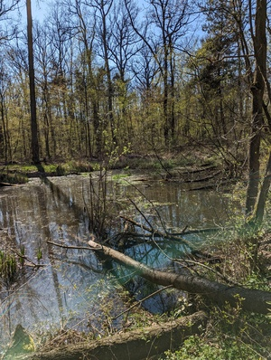
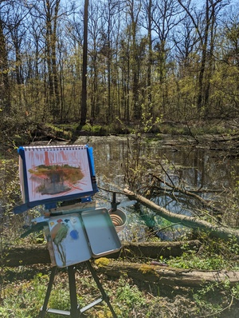
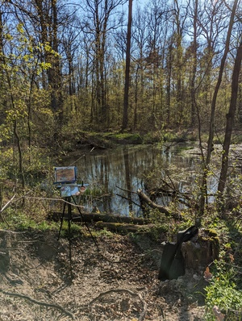
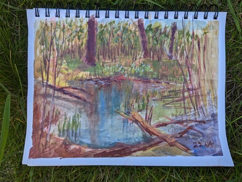

Pierwszy plener w zyciu.

Po wielu próbach na sucho w domu, prawie rocznym przygotowniu, budowaniu sztalugi w stylu Jamesa Gurneya, wreszcie udało mi się wybrać na samotny plener. 

## Miejsce
Naturalne stawy niedaleko Wołowa, piękne ustronne miejsce, nikt mi nie przeszkadzał :) 

## Materiały
Sztaluga - hand made, wydrukowane na drukarce 3d zawiasy oraz uchwyt do statywu, masa przyklejonych magnesów. Zadziałała super.  
Paleta - pudełko po markerach W&N, przyczepione na magnes do sztalugi. Bardzo dobre rozwiązanie, po wszystkim mogłem zamknąć pudełko i wrócić do domu bez sprzątania.  
Statyw - chyba najtanszy na allegro, niektore elementy juz sie popsuly, ale ogolnie działa.  
Papier - szkicownik Canson mix media. o ile papier w tym szkicowniku jest super, to sa pewne problemy w przyczepieniu go do sztalugi. na przyszłość prawdopodobnie uzyję paneli malarskich.  
Pędzle - renesans, brak uwag, choc nie mialem miejsca na sztadze zeby je odlozyc nieuzywane.  
Farby - Renesans Hydr-Oil. świetne farby i super na plener, bo nie trzeba wozic terpentyny, tylko wystarczy woda. Nie mialem jednak ze sobą medium, które by się przydało.
Bez medium te farby wyglądają trochę jak gwasze. Medium wymaga te dodatkowego pojemnika którego nie mam.  
Kubek na wodę - wymaga ulepszenia, spadł i woda się rozlała.  
teczka na mokry obraz - brak :(, choć tym razem nie była potrzebna.  

## Proces  
Mimo, ze byłem na to mentalnie przygotowany, malowanie z zycia okazało się trudniejsze niz myślałem. Chodzi mi głównie o wymyślenie kompozycji i ram obrazu. Do tej pory malowałem głównie ze zdjęć, gdzie ten problem jest od razu rozwiązany.
Pewien problem sprawiło mi równiez uzyskanie zywych, jasnych kolorów. Po przemyśleniu myślę, ze taki efekt da sie uzyskac przez lokalny kontrast (zywe - szare, jasne - ciemne). W moim obrazku wszystko jest za bardzo jednolite. 
Myślę tez, ze wybrałem zbyt szeroki temat. Koncentracja na jakims detalu ułatwiłaby pracę, zmniejszyła zakres i lepiej ustawiła wszystkie plany. 

## Podsumowanie  
Cała eskapada bardzo mi się podobała. Jest to wspaniały sposób na spędzanie czasu w naturze, na świezym powietrzu, odkrywanie nowych miejsc. Jedyny problem jest taki, ze trzeba mieć ze sobą cały plecak szpeju. Bedę pracował nad odchudzeniem setupu.
Myślę tez, ze kupowanie pudełek malarzy, pochade box, lub sztalug francuskich to na moim etapie zbyt duze zaangazowanie, spokojnie dam radę z tym co mam. 

## Galeria  

<ul id="media" class="clearfix justified-gallery">

</ul>
  
 
 
 
P.S. 
Od teraz przestawiam stronę na bycie w pełni polsko-języczną. Będzie mi łatwiej przelewać myśli na klawiaturę. W razie problemów proszę o kontakt.