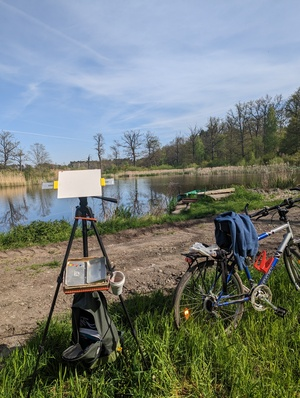
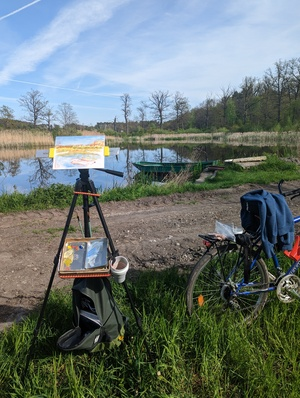
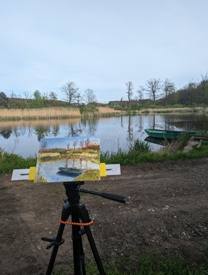
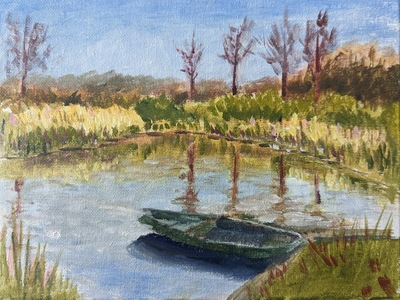

Plener nr 2

Weekend majowy sprzyjał spędzaniu czasu na świeżym powietrzu. 

## Miejsce
To samo co ostatnio, spokojne stawy niedaleko Wołowa.

## Materiały
Użyłem nowego systemu to trzymania deski malarskiej. System sprawdził się bardzo dobrze i jest dużo mniejszy. Czekam jeszcze na tacke z aliexpress która powinna ułatwić organizację sztalugi.
Użyłem tablicy malarskiej Phoenix. Plusem jej jest to, że bardzo dobrze trzymała się sztalugi, jednak bardzo trudno jest wypełnić farbą fakturę płótna. Następnym razem spróbuję użyć warstwy gesso, żeby temu zapobiec.`

## Proces  
Malowanie zajęło mi około 2 godziny. Dużo bardziej myślałem o procesie, dzięki temu plany są lepiej widoczne i jest wieksza różnorodność w nasyceniu barw. Kompozycja wyszła znowu taka sobie.  

## Galeria  

<ul id="media" class="clearfix justified-gallery">

</ul>
