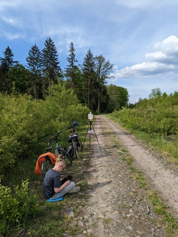
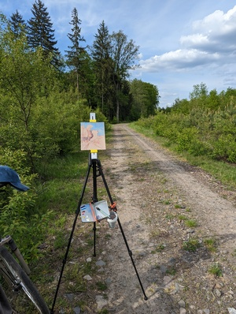
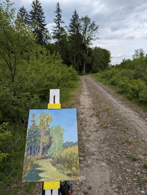
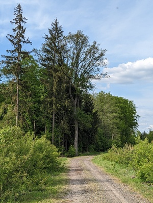
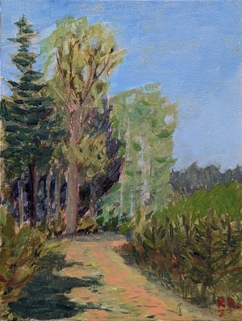

Plener nr 3 - postęp?

Raport z ostatniego pleneru. Wybrałem się z synem na wycieczkę rowerową połączoną z plenerem. Ja tradycyjnie malowałem farbami, syn na tablecie. Miejsce, las gdzieś pomiędzy Mojęcicami a Rudnem.  
Mój setup był taki sam jak poprzednio. Malowałem na panelu pokrytym gesso i myślę że było dużo lepiej. Myślę, że wreszcie udało mi się trafić kompozycyjnie, choć widzę pewne problemy z walorem planów. Mimo to myślę, że widać progres. 

## Galeria

<ul id="media" class="clearfix justified-gallery">

            
            

            
            

            

            
            

            
            

</ul>