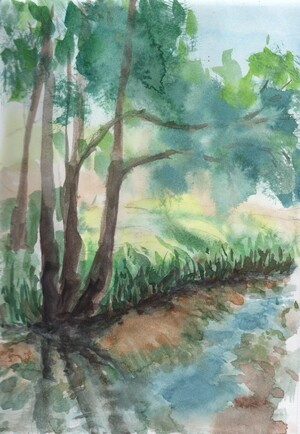

Plener Orzeszków

W weekend udało mi się zaliczyć kolejne  malowanie w plenerze. Miałem niewiele czasu bo ok 1,5 godziny. Plan miałem taki, żeby namalować bobrową tamę na rzece Jezierzyca niedaleko Orzeszkowa. Jednak brzeg był bardzo zarośnięty i nie mogłem znaleźć fajnego kadru tamy. Zadowoliłem się jednak brzegiem, w której zauważyłem ciekawe odbicia w wodzie i błyski. 
Dostanie się jednak do tego brzegu było dość problematyczne. Powinienem zabrać długie spodnie :) 

Obraz wyszedł nawet fajnie kompozycyjnie. Brakuje mi jednak na nim jakichs detali (gałęzi, traw) które sprawiłyby, że obraz byłby bardziej interesujący. Obraz wyszedł też dość szary. Użyłem nowego koloru (niebieski cerulian), który ma w sobie biały pigment, i myślę, że to mogło wlasnie zbić kolory.

Na drugi dzień zaatakowałem temat ze zdjęcia w akwareli. Efekt na ostatnim zdjęciu. myślę, że też wyszło fajnie. 

<ul id="media" class="clearfix justified-gallery">

            
            

            
            

            
            

            
            

            
            

</ul>