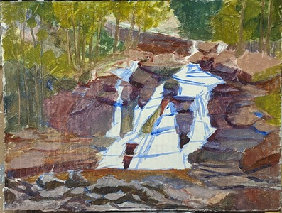

Namalowałem największy obraz olejny w życiu. 

Ma wymiary 30 na 40 cm i jest olbrzymi :) Malowanie zajęmo mi 3 wieczory. Oto kilka moich spostrzeżeń z procesu malowania:
1. szkic w błękicie i brązie fajnie od razu ustawił temperatury na całym obrazie.
2. zaznaczenie cieni na samym począ†ku bardzo dobrze pokazywało co jest gdzie. 
3. zielenie są ciągle zbyt nasycone (mimo, że próbowałem je zgasić) myślę, że w "drzewach" trzeba muszę użyć więcej szarości. 
4. myślę, że ciągle kładę farbę za cienko. 
5. robienie odpoczynków (malowanie jednego obrazu przez kilka dni) dobrze wpływa na sam obraz.
6. większa powierzcnia pozwała łatwiej wyciągnąć detale. 
7. Karton jednak nie nadaje się do poważniejszych prac. Wygiął się w łuk i przebijają się paski klenia perforacji. Wracam do myśli, że moją ulubioną powierzchnią do malowania jest papier w bloku. 

Bardzo podobało mi się malowanie na większej powierzchni i myślę, że kolejne obrazy też takie będą. 
  
<ul id="media" class="clearfix justified-gallery">

            
            

            
            

            
            

            
            

            
            

</ul>