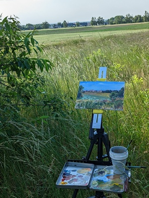

Plener na górce widokowej na Wołów

Szybki plener z widokiem na Wołów. W tym ćwiczeniu skupiłem się na dokładnym odtworzeniu koloru zieleni, z którą miałem problem w ostatnim obrazie. Myślę, że wyszło lepiej. 
Podoba mi się impresyjne ujęcie samego miasta. 

Był dość spory wiatr i setup wytrzymał, jednak uchwyt na płótno wymaga poprawy, bede nad nim pracował. 

<ul id="media" class="clearfix justified-gallery">

            
            

            
            

            
            

</ul>