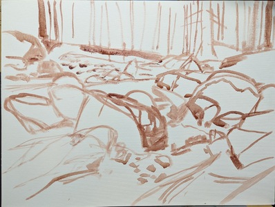
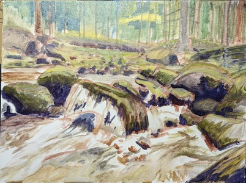
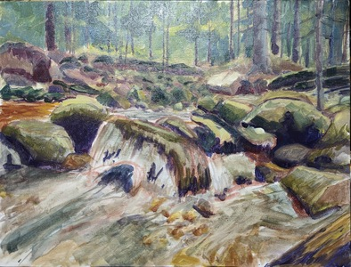

Proces malowania obrazu "Rzeka Szklarka".  

Olej na płótnie bawełnianym, 30x40cm

<ul id="media" class="clearfix justified-gallery">

            
            

            
            

            
            

            
            

</ul>