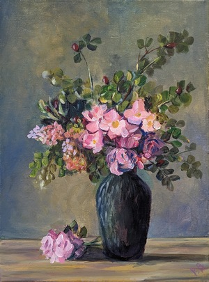
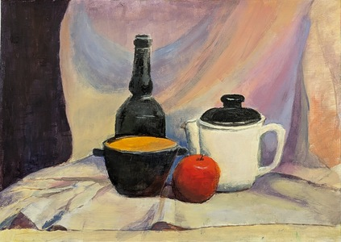
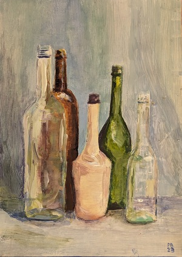

Podsumowanie roku w WOK

W kwietniu tego roku rozpocząłem uczęszczać na spotkania plastyczne dla dorosłych w Wołowskim Domu Kultury. Podczas tego czasu udało mi się namalować poniższe obrazy. 
Najważniejszym aspektem, który udało mi się pokonać tylko dzięki tym zajęciom to praca na wiekszym formacie oraz umiejetność podzielenia pracy na kilka dni. Na zajęcia wracam po wakacjach.

<ul id="media" class="clearfix justified-gallery">

            
            

            
            

            
            

</ul>