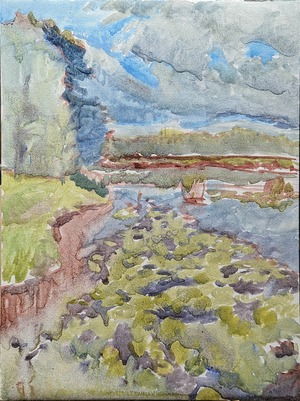
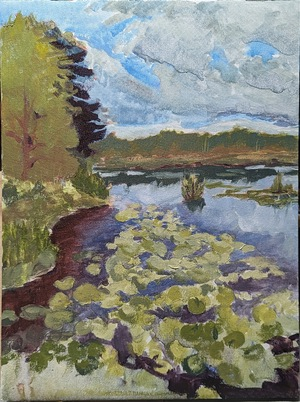
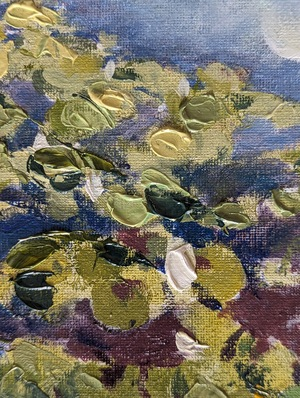

Proces malowania obrazu Nenufary

Olej na płótnie bawełnianym, 30x40cm

<ul id="media" class="clearfix justified-gallery">

Szkic plamą"
            data-download-url="../assets/images/001_nenufary/large_000.jpg"
            data-src="../assets/images/001_nenufary/large_000.jpg"
            data-exthumbimage="../assets/images/001_nenufary/thumb_000.jpg"
            >
            
            

Stan po dniu drugim"
            data-download-url="../assets/images/001_nenufary/large_001.jpg"
            data-src="../assets/images/001_nenufary/large_001.jpg"
            data-exthumbimage="../assets/images/001_nenufary/thumb_001.jpg"
            >
            
            

Efekt finalny"
            data-download-url="../assets/images/001_nenufary/large_002.jpg"
            data-src="../assets/images/001_nenufary/large_002.jpg"
            data-exthumbimage="../assets/images/001_nenufary/thumb_002.jpg"
            >
            
            

Detal"
            data-download-url="../assets/images/001_nenufary/large_003.jpg"
            data-src="../assets/images/001_nenufary/large_003.jpg"
            data-exthumbimage="../assets/images/001_nenufary/thumb_003.jpg"
            >
            
            

</ul>