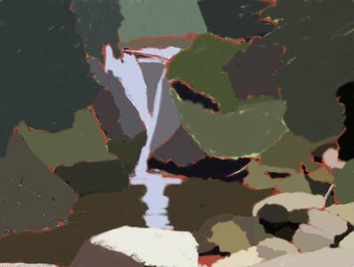
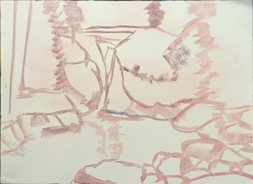
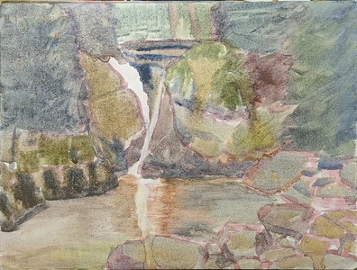
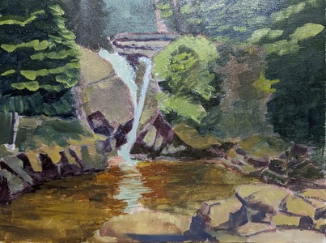
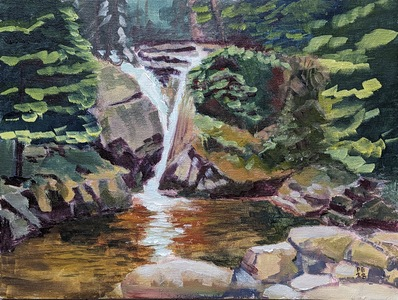

Proces malowania obrazu Wodospad Szklarka

1. Projekt na tablecie (zaznaczenie dużych kształtów na referencji). Pomocne we wstępnej analizie kolorów i planów.
2. Szkic. Obraz jest w całości raczej ciepły, wiec cały szkic w sienie palonej.
3. Faza "akwarelowa". Służy przykryciu całego płótna farbą. Prawdopodonie możnaby od razu wejść grubszą farbą, jednak pomaga mi to sprawdzić czy obraz "gra".
4. Malowanie właściwe. Farba rozcieńczana medium szybkoschnącym. Najważniejsze w tej fazie to dobrze wydobyć midtony i cienie.
5. Wykończenie. Highlighty i ostatnie poprawki.

  

<ul id="media" class="clearfix justified-gallery">

            
            

            
            

            
            

            
            

            
            

</ul>