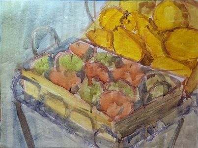
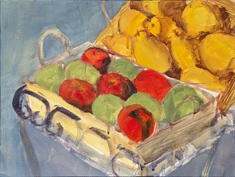
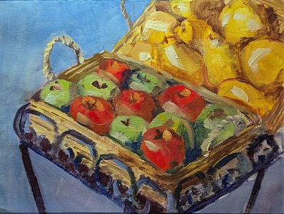
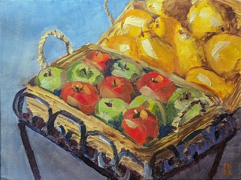

Proces malowania obrazu Jabłka i gruszki.

Olej na płótnie bawełnianym, 30x40cm  
Czas pracy: 3 sesje po 2 godziny.  

Zauważam, że mój proces się stabilizuje. To dobrze, mogę się skoncentrować na tym co chcę malować a nie jak. Drugą obserwacją jest to, że daję sobie pozwolenie na odejscie od realizmu. Dalej chcę, aby było wiadomo co przedstawia mój obraz, ale łatwiej mi nie skupiać się na szczegółach. 

<ul id="media" class="clearfix justified-gallery">

            
            

            
            

            
            

            
            

</ul>