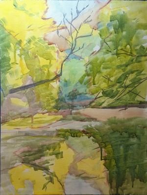
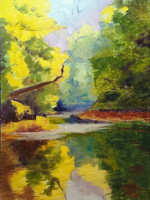
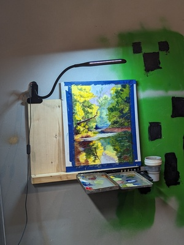
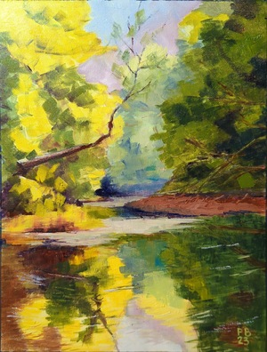

Proces malowania obrazu "Idzie jesień".

Olej na płótnie bawełnianym, 30x40cm  
Czas pracy: około 5 godzin.
Na podstawie zdjęcia z Pinterestu. Zdjęcie było ciekawe, ale mam wrażenie że mógłbym to lepiej dobrać kompozycyjnie. 

<ul id="media" class="clearfix justified-gallery">

            
            

            
            

            
            

            
            

</ul>