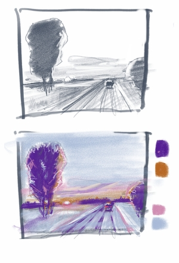

Zimą lubie malować zimę.  

A w tym roku snieg dopisał. po krotkiej przerwie chciałem namalować coś łatwego i małego. dlatego zdecydowałem się na format 18x24 na papierze. 
Eksperymentuje z procesem, stąd miniaturki na tablecie.  

<ul id="media" class="clearfix justified-gallery">

            
            

            
            

</ul>