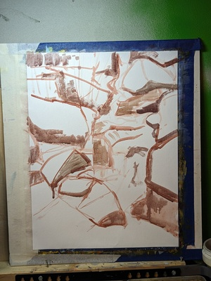
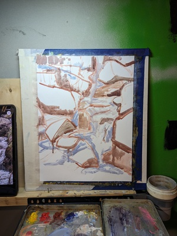
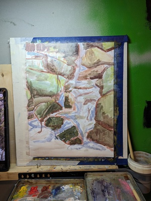
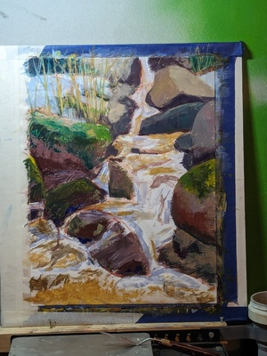

Tradycyjnie proces obrazu "Strumien w Szklarskiej"
Olej na płótnie, 30x40cm.
Pierwsze zdjęcie jest referencją, drugie szkicem w digitalu.  

<ul id="media" class="clearfix justified-gallery">

            
            

            
            

            
            

            
            

            
            

            
            

            
            

</ul>