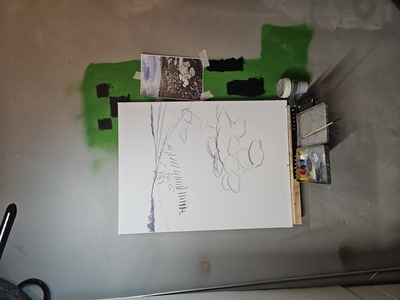
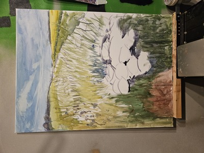
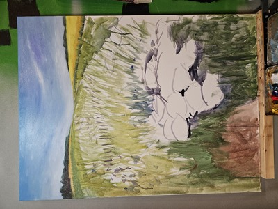
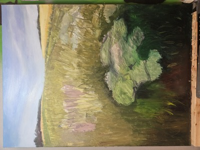
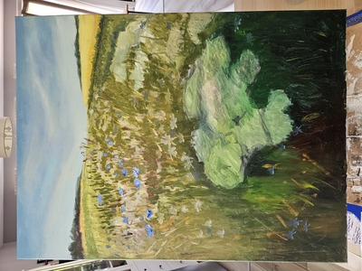
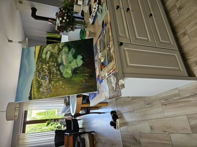
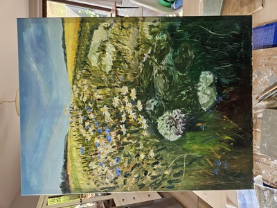
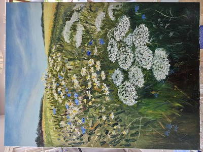
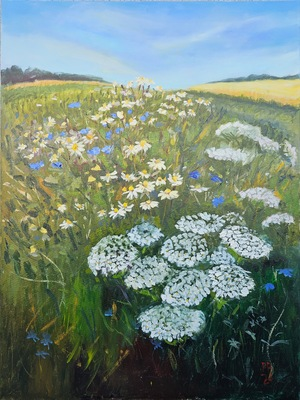

Proces malowania obrazu "Łąka".  

Wyobraź sobie ten syk świerszczy i 30 stopni dające po karku. Masz 10 lat, jesteś na wakacjach na wsi u babci i cały dzień przed sobą. W ręce jabłko papierówka i 50gr na oranżadę.  

Pani Danuta A. zachęciła mnie do namalowania obrazu na wiekszym formacie. Jest to 60x80cm, najwiekszy jaki był w Action :). jest to 4 razy wiekszy format niz taki na jakim zwykle maluje. Męczyłem się przez to bardzo. Obraz (z przerwami) malowałem miesiąc. Z jednej strony czuję, że dopiero to prawdziwy obraz, z drugiej psychicznie lepiej pracuje mi się z mniejszymi. Może to kwestia przyzwyczajenia. 

Technicznie popełniłem błąd, bo nie zrobiłem neutralnej podmalówki, co stało się problematyczne przy malowaniu krwawników, które są najjaśniejszym punktem obrazu. Planuję jeszcze jeden obraz polny, tym razem mniejszy, więc zobaczę, czy to zrobi róznicę.

<ul id="media" class="clearfix justified-gallery">

            
            

            
            

            
            

            
            

            
            

            
            

            
            

            
            

            
            

</ul>