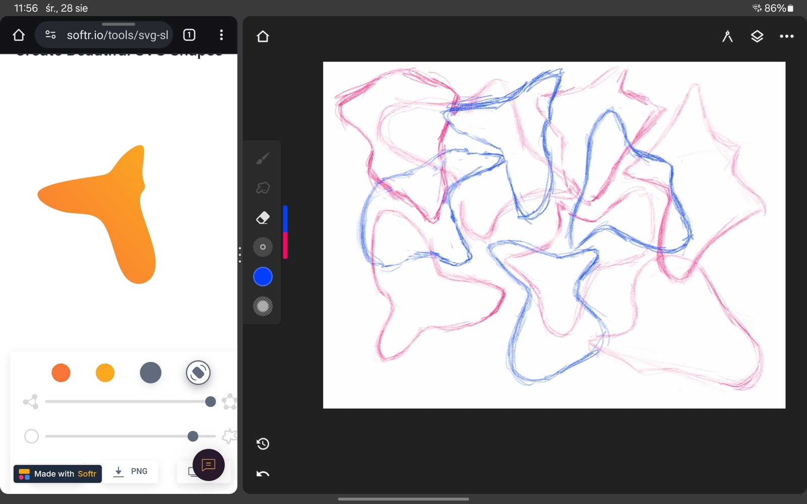

Najlepsza rada jaką znalałem w sieci.  

Chciałem się podzielić najlepszym ćwiczeniem / rozgrzewką rysowniczo - malarską na jaką trafiłem przeglądając internet. Nie pamiętam nawet źródła, ale był to jeden z tych filmików typu top 10 rzeczy które musisz robic jako artysta. Zwykle te rady w żaden sposób nie da się zaaplikować do mojej praktyki, ale ta jedna mianowicie trafiła w sedno. 

Bez zbędnego przedłużania co robimy:
1. przygotowujemy kartkę i ołówek lub dowolne inne narzęcie do rysowania
2. wchodzimy na stronę <a href="https://www.softr.io/tools/svg-shape-generator">Generator kształtów</a>
3. przerysowujemy kształt
4. klikamy generowanie nowego kształtu
5. powtarzamy od punktu 2. 
  
Moja przykładowa sesja wygląda tak:   
  
Jak widać, lubię to robić na tablecie, na podzielonym ekranie, po lewej mam wzór do przerysowania, a po prawej aplikację do rysowania. Przykład pokazuje 15 minutową sesję.

Dlaczego to ćwiczenie jest takie fajne? Po pierwsze, kształty są najważniejsze w rysowaniu, jeśli umiemy narysowac kształty, odnejdziemy je później w pejzażu czy portrecie i bedziemy w stanie odtworzyć je dokładnie. 
Po wtóre i kolejne, można to robić wszędzie, wzór mieć na telefonie a rysowac na kartce, może służyć jako rozgrzewka przed rysowaniem właściwym, lub sposób na medytację. nie musimy czasochłonnie wyszukiwać referencji do ćwiczeń. Można ograniczać czas na rysowanie jednego kształtu, a narzędzie pozwala na generowanie kształtów prostych jak i dość złożonych. 

BONUS  
do ćwiczenia kreatywności można po skończonej sesji przyjżeć się każdemu kształtowi i spróbować narysować dodatkowe szczegóły z jakimi kojarzy nam się kształt. przykładowo: kształt przypomina ptaka? dorysujmy resztę szczegółów.  

POLECAM :) 

